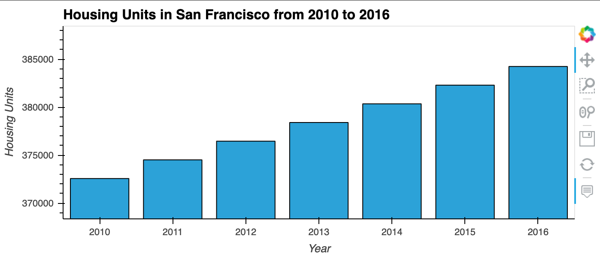
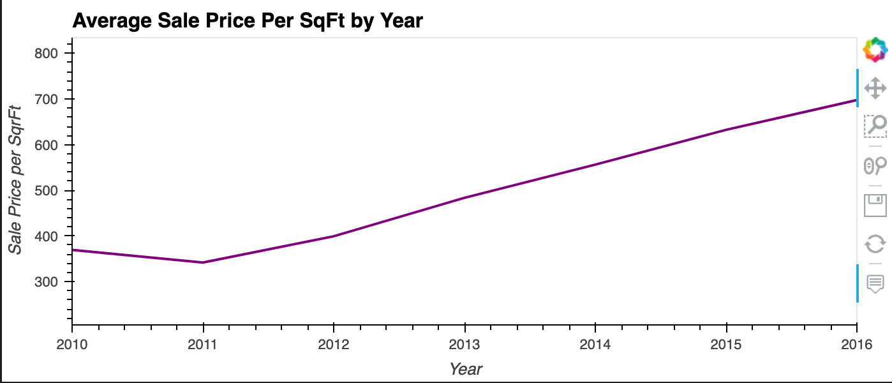
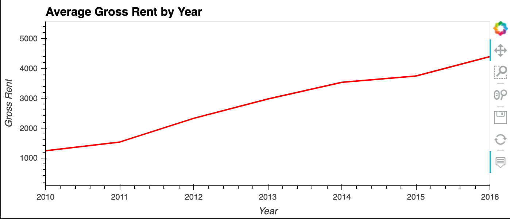
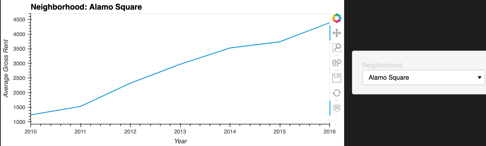
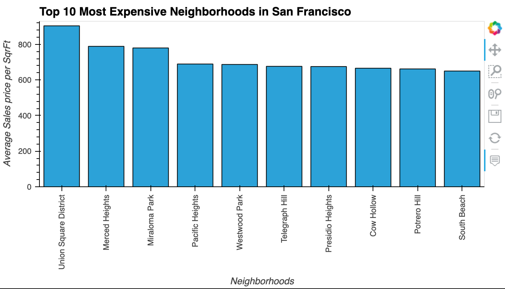
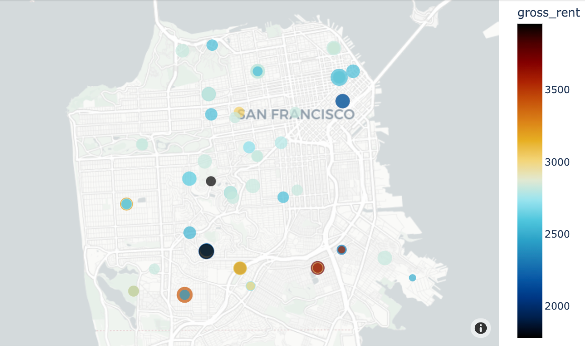
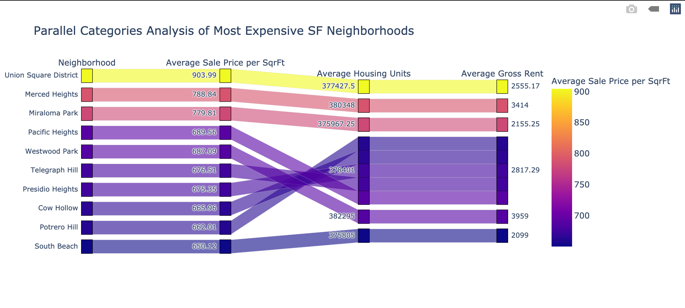

# PyViz - Pythonic Monopoly

Once I downloaded my JupyterLab files (rental_analysis, dashboard.ipynb) on github, I realized that my charts didn't render on github website. I guess, github software doesn't support interactive pyviz, hvplot, sunburst, and mapbox related charts. One reason could be that the interactive charts have lots of code running behind scenes which, currently - due to the size or copyright issues - are not supported by github. So, following are all the charts in-order of appearances in my rental_analysis.ipynb file. Dashboard.ipynb charts are similar but, due to tabs etc., I will recommend running the code on your local machine. It will display all the charts in Dashboard (with tabs, interactive etc.) on your new localhost web window.

 
 
 
 
 
 
 
 
 
 
 
