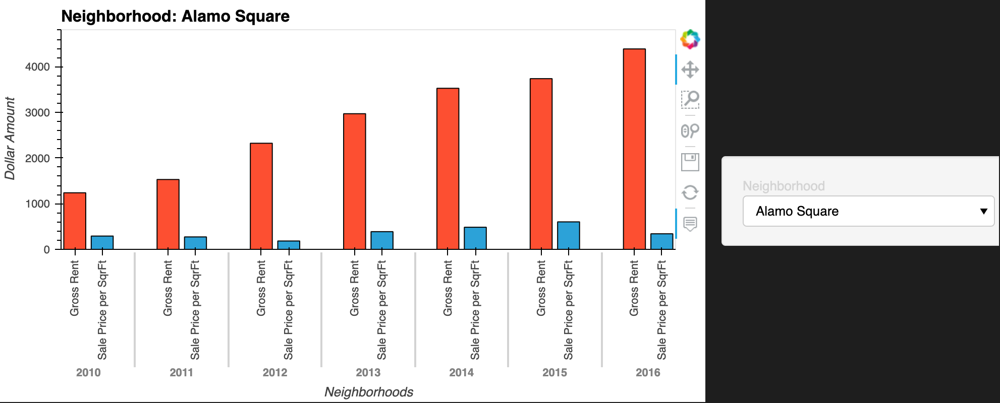

    # PyViz Homework
   
    "Once I downloaded my JupyterLab files (rental_analysis, dashboard.ipynb) on github, I realized that my charts didn't render on github website. I guess, github software doesn't support interactive pyviz, hvplot, sunburst, and mapbox related charts. One reason could be the interactive charts have lots of code running behind scenes which, currently - due to the size or copyright issues - are not supported by github. So, following are all the charts in-order of appearances in my rental_analysis.ipynb file. Dashboard.ipynb charts are similar but, due to tabs etc., I will recommend running the code on your local machine. It will display all the charts in Dashboard (with tabs, interactive etc.) on your new localhost web window. \n",
    "\n",
    "\n",
    "\n",
    "\n",
    "\n",
    "\n",
    "\n",
    "\n",
    "\n",
    "\n",
    "\n",
    "\n",
    ""
   ]
  },
  {
   "cell_type": "code",
   "execution_count": null,
   "id": "8e8331f4",
   "metadata": {},
   "outputs": [],
   "source": []
  }
 ],
 "metadata": {
  "kernelspec": {
   "display_name": "Python 3",
   "language": "python",
   "name": "python3"
  },
  "language_info": {
   "codemirror_mode": {
    "name": "ipython",
    "version": 3
   },
   "file_extension": ".py",
   "mimetype": "text/x-python",
   "name": "python",
   "nbconvert_exporter": "python",
   "pygments_lexer": "ipython3",
   "version": "3.7.10"
  }
 },
 "nbformat": 4,
 "nbformat_minor": 5
}
